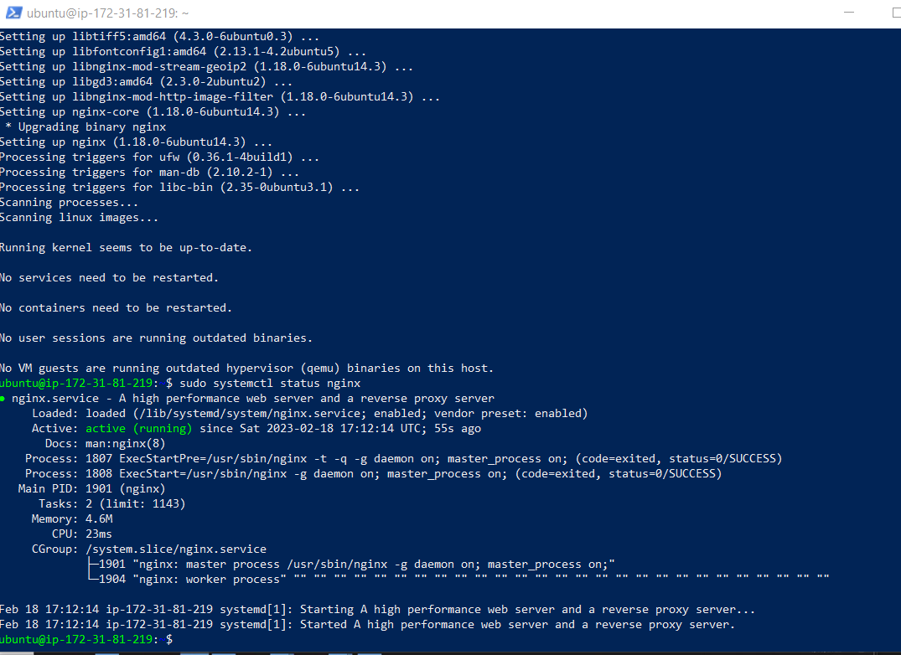
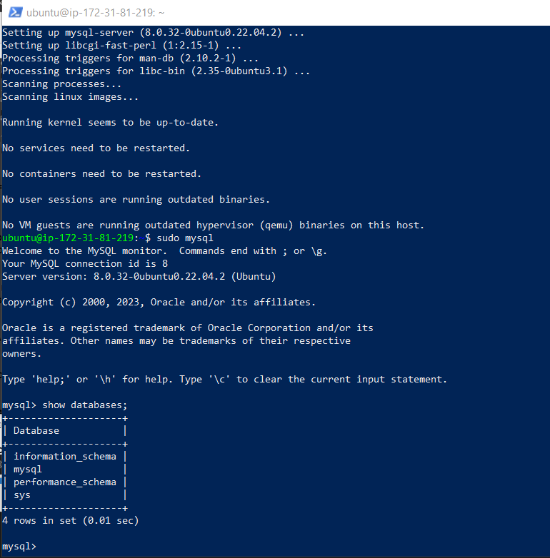
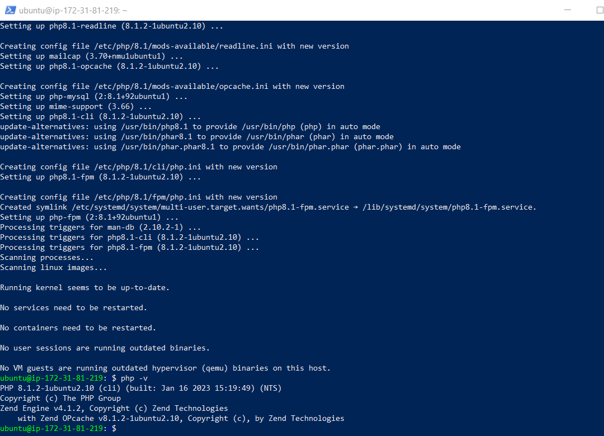
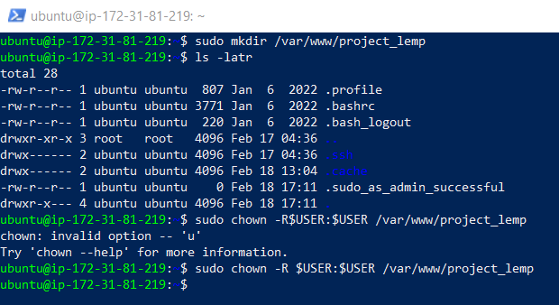
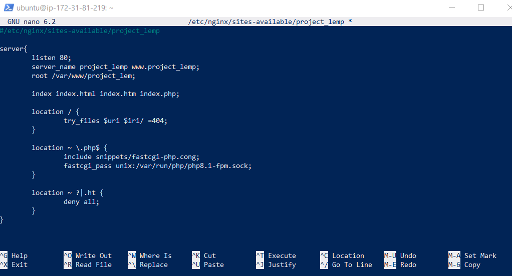
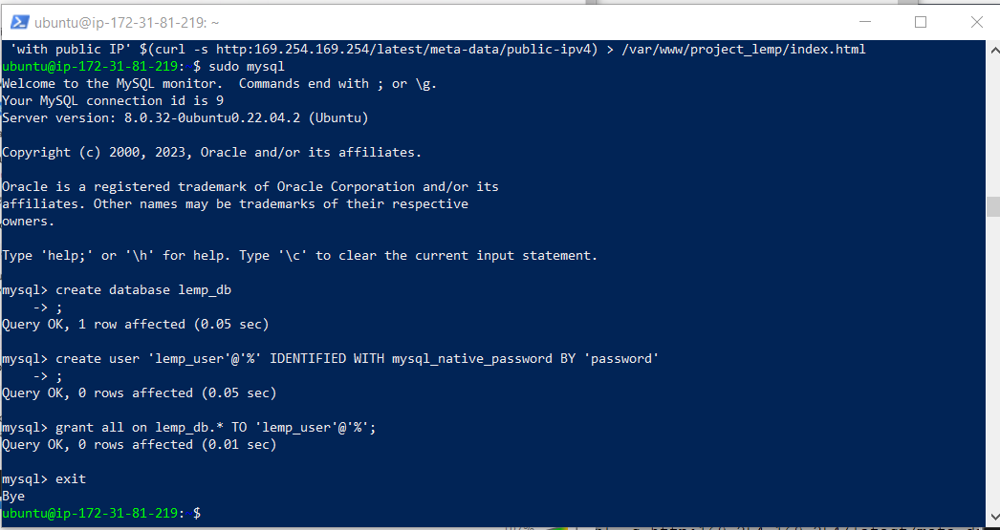
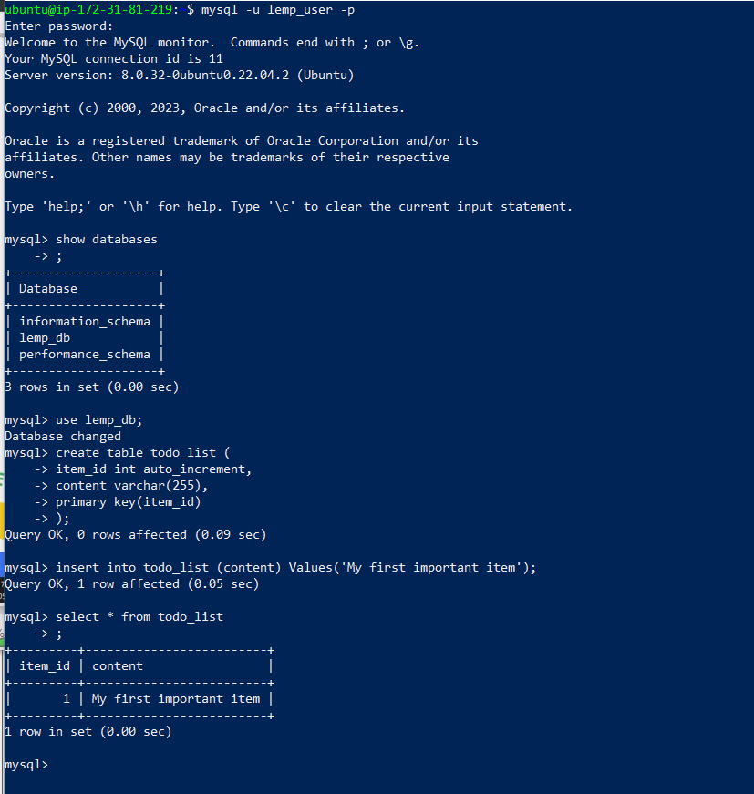
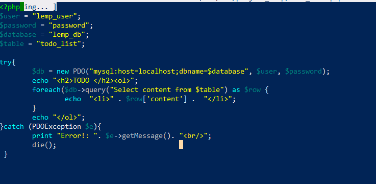
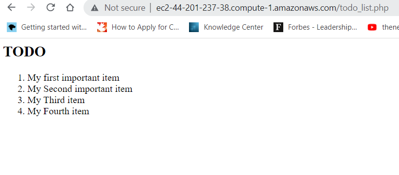

# DevOps-PBL-project-2
PROJECT 2: LEMP STACK IMPLEMENTATION 

This project will extend your knowledge of various Web Stacks. It requires you to deploy and configure a LEMP solution using a very popular Web Server – NGINX.

## 1. update ubuntu packages
sudo apt 

## 2. install nginx
sudo apt install nginx

sudo systemctl status nginx

sample output of installation result

## 3. install mysql

sudo apt install mysql-server

sudo mysql

mysql describe database

exit

sample out put of default databases installed

## 4. install php and its dependencies

sudo apt install php-fpm php-mysql -y

## 5. defining domain root and ownership

## 6. configure nginx

## 7. create user and grant priviledges 

## 8. create database and insert records

## 9. create sample php-script 

